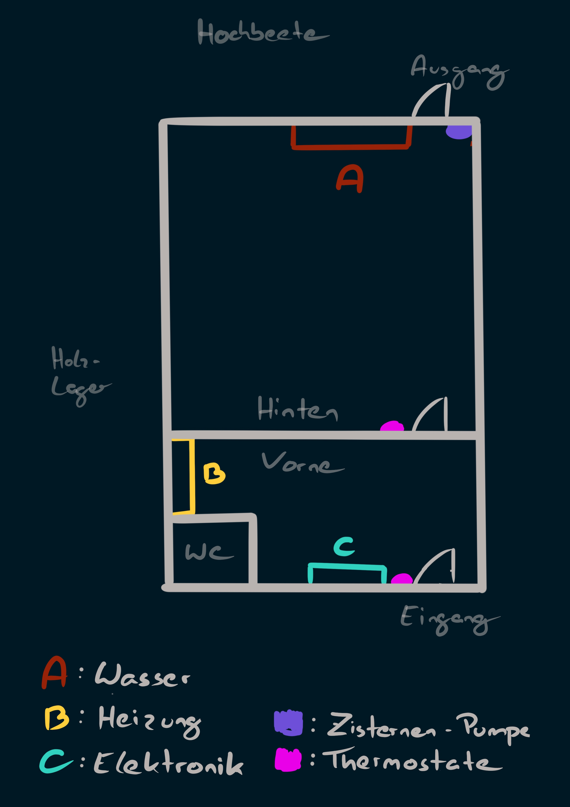

# Glashaus

## Grundriss

### Innen
A) Wasser <link>
B) Heizung <link>
C) Elektronik <link>

---

### Außen
Wetterstation

---
# Beschreibung

## A) Wasser

Hier werden die unterschiedlichen Wasserkreisläufe gesteuert.

## B) Heizung

Wenn die Heizung nicht funktioniert, muss man hier nachsehen. Es ist wichtig, dass der Druck ca. im "Grünen Bereich" (ca. 1,5 bar) ist. Sollte dies nicht der Fall sein, die Haustechnik <telefon> anrufen. Diese füllt die Heizung dann wieder auf.

Sollte der Druck bei ca. 1,5 bar sein und die Heizung geht trotzdem nicht, muss wahrscheinlich ein Heizungstechniker kommen. Vorher den Thermostat kontrollieren, ob dieser versehentlich abgedreht wurde.

### Weitere Informationen

- Aufgefüllt wird bis ca. 2 bar.
- Es darf niemals über 4 bar aufgefüllt werden.

## C) Elektronik

## Inhaltsangabe:
### Außen
1. Windmesser & Thermometer

### Glashaus Vorne

## Überblick

2. Einstellungen
	2.1 Betriebseinstellungen
	2.2 Feineinstellungen
	2.3 Einzelsicherungen

3. Hauptsicherungen
### Hinten

## 1. Windmesser & Thermometer

A) Windmesser B) Thermometer

### Wichtige Informationen

Diese Messgeräte haben das letzte Wort und überschreiben alle anderen Einstellungen (auch manuelle). Sie dienen als Schutz. Die Fenster schließen automatisch bei ca. 5-7 °C oder bei zu starkem Wind.

## 2. Einstellungen

### Betriebseinstellungen
Hier können

##

Hinter dieser Schaltfläche (lässt sich mit dem Schlüssel unten links öffnen) ist Folgendes:

A) Einstellungen B) Sicherungen C) **todo scan**

2.1 Einstellungen

Hier kann man die Feinjustierungen vornehmen. Genauere Informationen sind in der Anleitung zu finden. Die Geräte sind sehr feinfühlig und millimetergenau. Wenn man sie dreht, spürt man eine Art Klicken. Es ist ratsam, die Anlage immer nur um wenige Klicks (mm) zu justieren.

B) Sicherungen

Hier sind die Einzelsicherungen für alle Geräte im Glashaus. Wenn der schwarze Stift heraussteht, heißt das, dass die Sicherung ausgelöst hat.