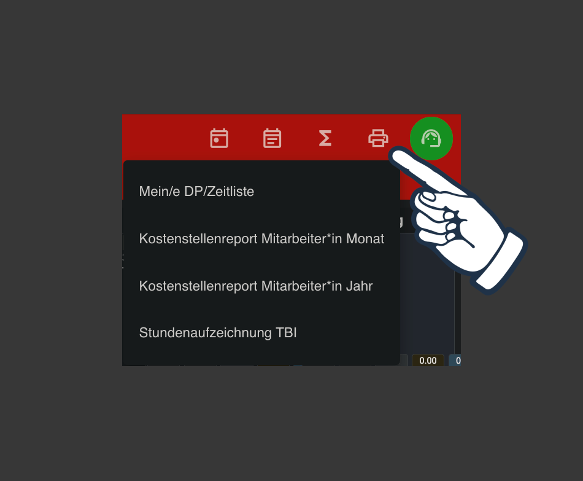

# Datenschutz

Ich wurde netterweise darauf hingewiesen, dass hier möglicherweise Datenschutzprobleme entstehen könnten. Wem dies (zurecht) ein großes Anliegen ist, sollte:

Nur einen Screenshot von den Zeiten machen und diesen entweder als Foto, oder mittels OCR als Text, hochladen.

# Prompt

```
Analysiere die bereitgestellte PDF-Datei (Dienstplan/Zeitliste).
Falls ein Tag zwei Einträge hat, kombiniere diese zu einem einzigen Eintrag.
Gib den Zeitplan im CSV-Format aus, mit den Spalten:
'Betreff', 'Startdatum', 'Startzeit', 'Enddatum', 'Endzeit', 'Ganztägiges Ereignis', 'Beschreibung', 'Ort'.
Gehe davon aus, dass sich die Einträge innerhalb des aktuellen Monats/Jahres befinden, und verwende die Zeitzone 'Europe/Vienna'.
Generiere die vollständigen CSV-Daten in einem einzigen Markdown-Codeblock.
```

Die Ausgabe der KI kannst du z.B. als "dienstplan.csv" speichern. Diese Datei kann in fast jede Kalender-App importiert werden.

---

# Download

Die PDF-Datei findest du unter:

e-Zeiterfassung -> Meine Monatsübersicht -> Berichte -> Meine/r DP/Zeitliste


