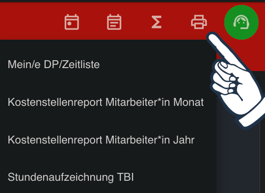

# Download
e-Zeiterfassung -> Meine Monatsübersicht -> Berichte -> Meine/e DP/Zeitliste



---

# Prompt
```
Analysiere die bereitgestellte PDF-Datei (Dienstplan/Zeitliste). 
In der Datei ist eine Pause eingetragen.
Kombiniere die zwei Tageshälften zu einem einzelnen Eintrag.
Gib den Zeitplan im CSV-Format aus, mit den Spalten:
'Betreff', 'Startdatum', 'Startzeit', 'Enddatum', 'Endzeit', 'Ganztägiges Ereignis', 'Beschreibung', 'Ort'.
Gehe davon aus, dass sich die Einträge innerhalb des aktuellen Monats/Jahres befinden und verwende die Zeitzone 'Europe/Vienna'.
Generiere die vollständigen CSV-Daten in einem einzelnen Markdown-Codeblock.
```

Die Ausgabe der KI kannst du z. B. als "dienstplan.csv" speichern. Diese Datei kann in fast jede Kalender-App importiert werden.
